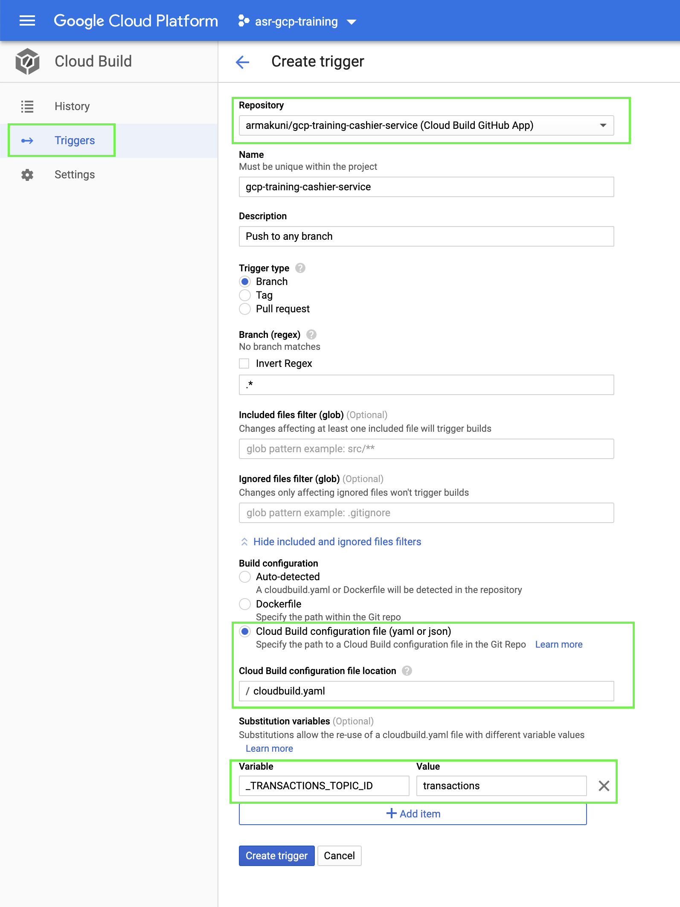

# Cashier Service
This Microservice allows the cashier to create new transactions by exposing an HTTP endpoint and then sending transactions to [PubSub](https://cloud.google.com/pubsub/docs/) queues for further processing.

POST - http://localhost:5004/cashier/create to create a transaction of 'debit' or 'credit' type and accept below request body with just "customerId":
 ```json
  {
	"accountNumber":"92887275",
	"amount":20,
	"operation":"debit"
  }
 ```
 Response:
  ```json
  {
    "accountNumber": "92887275",
    "amount": 20,
    "created": "2020-01-23T17:41:40Z",
    "id": "ed4b1ef1-74c2-4c49-93f7-a45ba9e6c57b",
    "operation": "debit",
    "status": "accepted"
  }
  ```
Fork this repository in your github account to continue the rest of exercise.

### Requirements

- A Pub/Sub topic for transactions, up and running in your Google Cloud account
- Ideally, the Transaction service up and running and subscribed to the topic we will use with service

### Environment variables

The Cashier and Transaction services communicate via a pub sub topic on GCP, so make sure that the same topic name is used for both services.

The service uses the below variables in its configuration. They all have default values as shown below if they are not otherwise specified:

```
PORT=5004(default)
```

The transactions topic ID is also required for the cashier service to publish to the correct channel and interact with the transactions service.
This must be set into the below variable:

```
TRANSACTIONS_TOPIC_ID=[TRANSACTION_TOPIC_ID]
```

### To run linter
```bash
make lint
```

### To run tests
```bash
make test
```

### To run service locally
Before running the application locally you must set credentials json file locally to authenticate as we did for other Microservices.
```bash
export GOOGLE_APPLICATION_CREDENTIALS=[PATH_TO_CREDENTIALS_FILE]/[SERVICE_ACCOUNT_CREDENTIALS_FILENAME].json 
```

```bash
make run
```

### Deployment

#### CLI Deployment

This repository contains a cloudbuild.yaml file to deploy service on to Cloud Run.
Execute the below command to trigger a Cloud Build Deployment after replacing the variables with appropriate values.

```bash
gcloud builds submit --substitutions=_TRANSACTIONS_TOPIC_ID="[TRANSACTIONS_TOPIC_ID]"
```
where [TRANSACTIONS_TOPIC_ID] is the ID of the Pub/Sub topic that publishes messages to the Transaction service.

If you have used the ```gcp-infrastructure-script``` to provision the required resources and have not changed any values than the default topic id would be ```"transactions"```.
If not kindly replace with an appropriate value.

#### Setup Cloud Build Trigger to deploy Microservice on each commit

Now let us set up a Cloud Build Trigger to deploy the changes automatically with each commit.

1. Navigate to the Cloud Build page in the console and click ```Triggers```
2. Click ```Create Trigger``` and should open a new page.
3. Enter all the information highlighted in the below image.
4. Set the substitutions variables appropriately (preferably the same as the CLI step). As explained earlier if you wish you change the variable name you must change in the "cloudbuild.yaml" as well.
5. The values specified here will override any default values defined in the "cloudbuild.yaml". If you wish to change the value make a note of it.



6. Click Create Trigger and your trigger should be ready to use.
7. Make a commit and observe Cloud Build to confirm the trigger is working fine.

### API documentation

You can access the swagger API documentation by launching the application by adding 'cashier/docs' in the service endpoint
